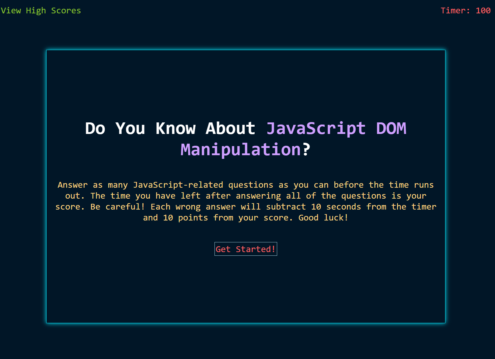
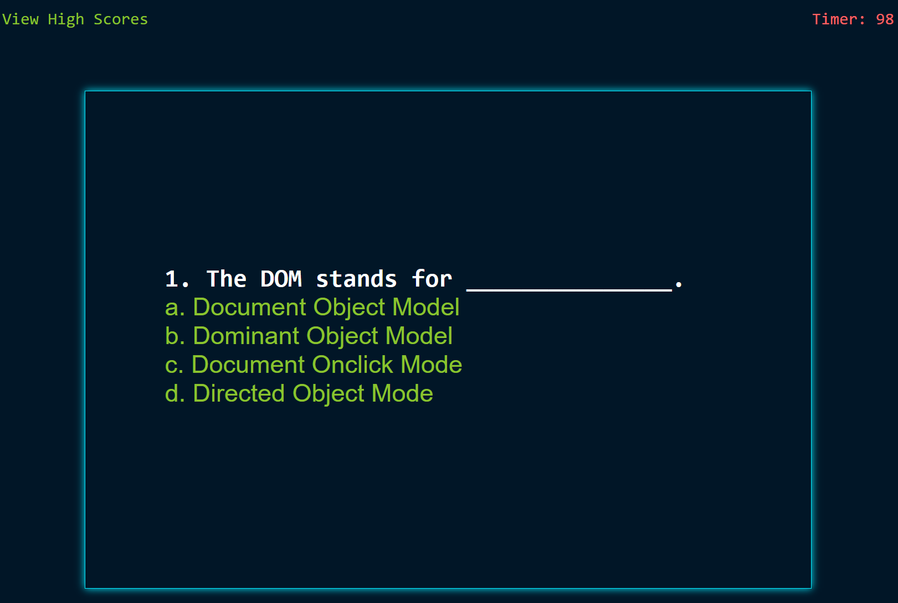
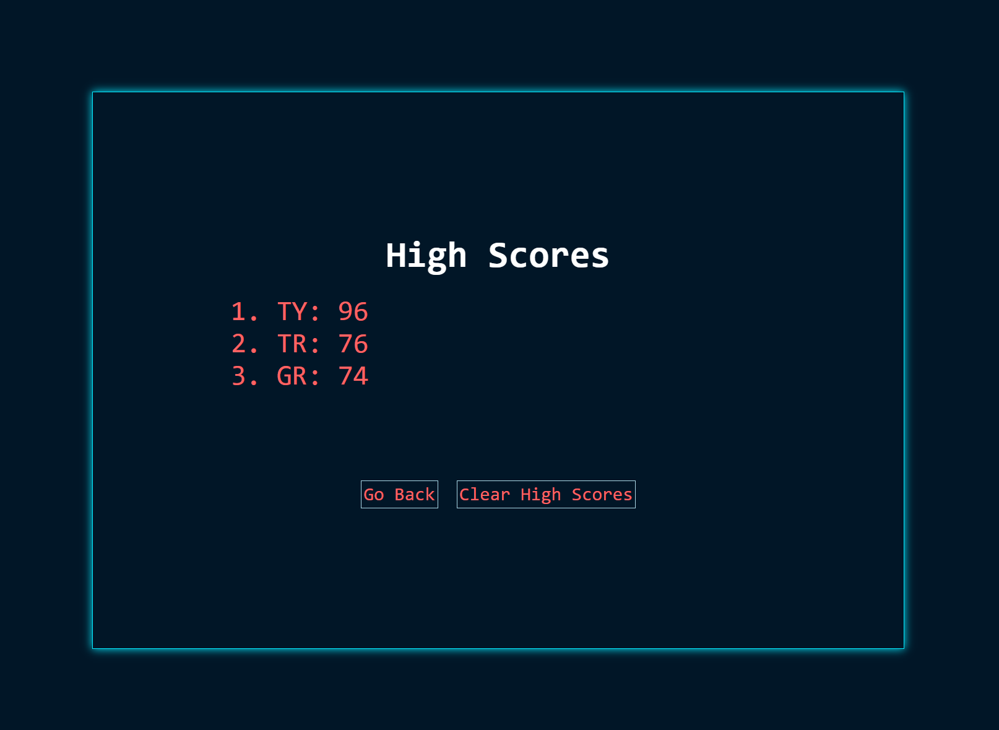

# Code-Quiz

## Description

This project was created to give a timed quiz that stores high scores to a boot camp student so that they can gauge their progress. This is done by fulfilling the following requirements:
* When the start button is clicked, the timer starts and the first question is shown.
* When a question is answered, the next question appears.
* When a question is answered incorrectly, time is subtracted from the timer.
* When all questions are answered or the timer says 0, the game is over.
* When the game is over, the user can save their initials and high score.

## Table of Contents (Optional)
- [Installation](#installation)
- [Links](#links)
- [Usage](#usage)
- [Creation](#creation)
- [Credits](#credits)
- [License](#license)
- [Project-status](#project-status)

## Installation
The repository, Code-Quiz, was created and cloned from GitHub. An index.html file and highscores.html file were created and were coded to contain the site content for the index and highscore pages, respectively. A folder, assets, was created to house two folders, css and js.  The css folder contains the style sheet for the index page, style.css, and the style sheet for the highscore page, hsstyle.css, which were created and coded to contain the site formatting and design for the index and highscore pages, respectively. The js folder contains the script sheet, script.js and highscores.js, which were created and coded to allow the site to be dynamic.

## Links
- [GitHub Repository](https://github.com/amklenk/Code-Quiz)
- [GitHub Pages Site](https://amklenk.github.io/Code-Quiz/)

## Usage

Below are screenshots that show the site before the quiz starts, the site during a question, and then when the high scores page is deployed.

The site should be navigable via clicking the start button, each answer choice, then submit after the user enters their initials, and the go back button on the highscores page.

## Creation
Each of the requirements were fulfilled:
* When the start button is clicked, the timer starts and the first question is shown.
* When a question is answered, the next question appears.
* When a question is answered incorrectly, time is subtracted from the timer.
*When all questions are answered or the timer says 0, the game is over.
*When the game is over, the user can save their initials and high score.

Once the repository was stored locally, the html, css, and js files were created in their respective folders.

The boilerplate HTML was created first for both the index and highscores pages. Then hard coded content (which would be removed later dynamically for the index page) was coded. The CSS styling sheets were both coded to reflect the colors/style of the VS code theme Night Owl. Each styling sheet is organized by where each element appears in the HTML code and is then organized by element and then by class.

The JS code in the script file was organized to flow as the main site flows. The global variables are at the top so that they can be accessed throughout the game. The question object is there as well. The timer function is listed first and then the event listener to start the game and the timer. Each question has its own function to dynamically create elements, set their attributes and text content(either referencing the questions object or hard coded) and append them to the page. Each subsequent question removes the previous elements and then repeats the process of the question before it. The last question function calls on the saveScores function, which saves the scores to local storage by pushing the values into a global array and using JSON.stringify. This function also directs the user to the highscores page. The highscores page has its own script page, highscores.js. It contains the referenced global variables and the function loadScores which prints the scores to the page in descending order by score. The user is then able to navigate back to the quiz or erase their high scores.

## Credits
The following MDN website was used as a reference page for the quiz answers:
[Document - Web APIS | MDN](https://developer.mozilla.org/en-US/docs/Web/API/Document)

## License

MIT License

Copyright (c) [2022] [Amanda Klenk]

Permission is hereby granted, free of charge, to any person obtaining a copy
of this software and associated documentation files (the "Software"), to deal
in the Software without restriction, including without limitation the rights
to use, copy, modify, merge, publish, distribute, sublicense, and/or sell
copies of the Software, and to permit persons to whom the Software is
furnished to do so, subject to the following conditions:

The above copyright notice and this permission notice shall be included in all
copies or substantial portions of the Software.

THE SOFTWARE IS PROVIDED "AS IS", WITHOUT WARRANTY OF ANY KIND, EXPRESS OR
IMPLIED, INCLUDING BUT NOT LIMITED TO THE WARRANTIES OF MERCHANTABILITY,
FITNESS FOR A PARTICULAR PURPOSE AND NONINFRINGEMENT. IN NO EVENT SHALL THE
AUTHORS OR COPYRIGHT HOLDERS BE LIABLE FOR ANY CLAIM, DAMAGES OR OTHER
LIABILITY, WHETHER IN AN ACTION OF CONTRACT, TORT OR OTHERWISE, ARISING FROM,
OUT OF OR IN CONNECTION WITH THE SOFTWARE OR THE USE OR OTHER DEALINGS IN THE
SOFTWARE.

## Project Status

This project is a work in progress. It will be updated via a develop and feature branches going forward. The JS code has a lot of repetition and needs to be refactored, perhaps with one function for generating the questions and answers with for loops for printing both. The timer lags when the start game button is clicked and needs to be fixed. The appending/removing of each answer message doesn't flow seamlessly. The design needs to be reconfigured for mobile screens, perhaps using Bootstrap and/or media queries.

